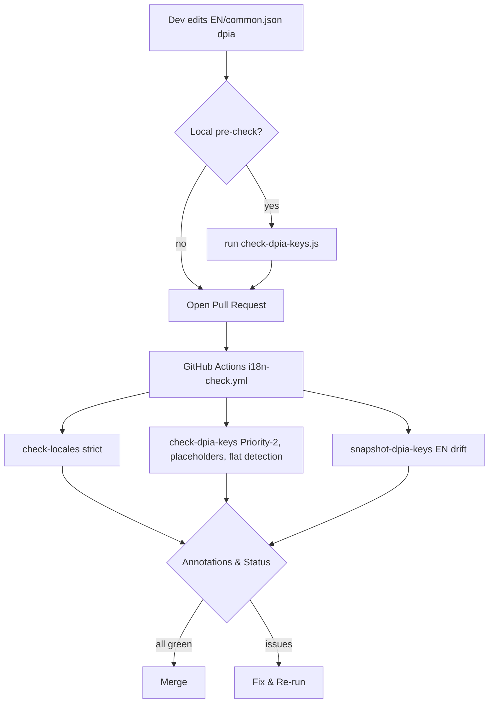
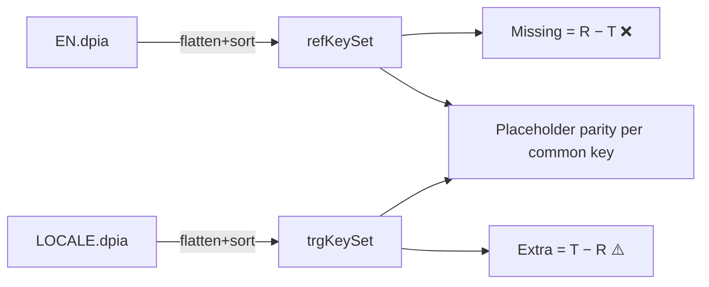

# i18n Architecture & CI Process

> **Purpose:** Technical overview of our i18n system, end-to-end flow from EN reference to all locales, and CI enforcement (DPIA focus). Complements `docs/i18n-guide.md`.

---

## 1) System Goals

- Consistent **key structure** across locales (incl. nested `dpia`)
- Strict **placeholder parity** vs. EN (configurable fail via `FAIL_ON_PLACEHOLDER`)
- Early detection of **EN schema drift** (snapshot guard)
- Fast feedback on **Priority-2** locales (BG, DA, EL, ET, FI, GA, HR, HU, LT, LV, MT, PT, RO, SK, SL, NO, IS, CA)
- Deterministic outputs (sorted flattening, UTF-8 w/o BOM)

---

## 2) Core Components

- `public/locales/en/common.json` → **Reference** (must include `dpia`)
- `public/locales/<lang>/common.json` → Target locales
- `scripts/check-locales.js` → Generic structure/type diff (`--diff`, `--fix`)
- `scripts/check-dpia-keys.js` → DPIA-specific validator (arrays, placeholders, flat-key detection, Priority-2 filter)
- `scripts/snapshot-dpia-keys.js` → EN drift detector & snapshot generator
- `scripts/dpia-keys.snapshot.json` → Baseline of EN `dpia` keypaths
- `.github/workflows/i18n-check.yml` → CI orchestration

---

## 3) Directory Layout

```
public/
  locales/
    en/
      common.json
    da/
      common.json
    ...
scripts/
  check-locales.js
  check-dpia-keys.js
  snapshot-dpia-keys.js
  dpia-keys.snapshot.json
.github/
  workflows/
    i18n-check.yml
docs/
  i18n-guide.md
  i18n-architecture.md
```

---

## 4) Data Flow (Dev → CI → Merge)



**DPIA Keyset Comparison (simplified)**



---

## 5) CI Pipeline Stages

1. **Setup & Install**
   - Node 20, `npm ci`

2. **Structure Check**
   - `node scripts/check-locales.js --ref en --path public/locales --namespace common`

3. **DPIA Keyset Check**
   - `FAIL_ON_PLACEHOLDER=1 node scripts/check-dpia-keys.js`
   - Validates: arrays, nested structure, flat `dpia.*` at root, placeholders

4. **EN Drift Guard**
   - `node scripts/snapshot-dpia-keys.js`
   - Fails when ref keys changed vs snapshot

5. **Annotations**
   - Uses `::error` / `::warning` for precise GH UI markers

**Failure Policy**

- Missing keys → ❌ block
- Extra keys → ⚠️ warn
- Placeholder mismatch → ❌ if `FAIL_ON_PLACEHOLDER=1`, else ⚠️
- Flat `dpia.*` at root → ⚠️ warn + fix required
- EN drift → ❌ until snapshot updated & committed

---

## 6) Roles & Responsibilities

- **Feature Devs:** Change EN first; update snapshot with `--update` only on intentional schema changes.
- **Translators:** Translate values only; keep placeholders intact; no structural edits.
- **Maintainers:** Review annotations; require Priority-2 green before merge.

---

## 7) Best Practices

- Prefer **nested namespaces** for new domains (e.g., `dpia`, `legal`)
- Keep placeholders **verbatim** (`{appName}`, ICU where used)
- Batch EN structural changes; update snapshot **in the same PR**
- Save JSON as **UTF-8 without BOM**; no trailing commas
- Optional pre-commit: run `node scripts/check-dpia-keys.js` on changed locales

---

## 8) Error Taxonomy & Actions

| Error               | Cause                      | Action                                 |
| ------------------- | -------------------------- | -------------------------------------- |
| Missing `dpia`      | Locale lacks nested object | Add `dpia` object and move keys inside |
| Flat `dpia.*`       | Wrongly flattened at root  | Nest under `dpia`                      |
| Missing keys        | Drift vs EN                | Add or `--fix`, then translate         |
| Extra keys          | Residual/dead              | Remove or confirm intentional          |
| Placeholder missing | Translator dropped `{var}` | Restore placeholders                   |
| Placeholder extra   | Added unknown `{var}`      | Remove unknown placeholders            |
| Parse/BOM error     | Formatting                 | Fix JSON, save UTF-8 w/o BOM           |

---

## 9) Commands (Quick Reference)

- Validate all locales: `node scripts/check-locales.js --ref en`
- DPIA check: `node scripts/check-dpia-keys.js`
- Show diffs: `node scripts/check-locales.js --ref en --diff`
- Auto-fill missing keys: `node scripts/check-locales.js --ref en --fix`
- Verify EN snapshot: `node scripts/snapshot-dpia-keys.js`
- Update EN snapshot: `node scripts/snapshot-dpia-keys.js --update`

---

## 10) CI Snippet (reference)

```yaml
- uses: actions/setup-node@v4
  with:
    node-version: '20'
    cache: 'npm'
- run: npm ci

- name: Check locales (strict)
  run: node scripts/check-locales.js --ref en --path public/locales --namespace common

- name: DPIA keyset check (Priority-2)
  env:
    FAIL_ON_PLACEHOLDER: "1"
  run: |
    echo "::group::DPIA keyset check"
    node scripts/check-dpia-keys.js
    echo "::endgroup::"

- name: Verify DPIA key snapshot (EN drift)
  run: node scripts/snapshot-dpia-keys.js
```

---

**Owner:** i18n Maintainers  
**Last updated:** 2025-01-21
